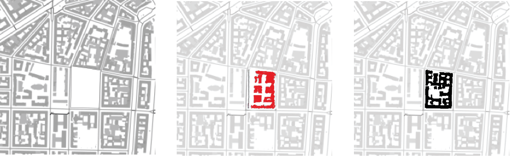

# UrbanGen

Welcome to GAN for Urban Design project! It is a research on the use of Generative Adversarial Networks in the field of generative Urban Deisgn. Here, in particular, I have used a Pix2Pix model with the implementation from <a href="https://www.coursera.org/specializations/generative-adversarial-networks-gans">GANs Specialization</a>.

_Some of the results achieved during training. The generated blocks are highighted with red color for the sake of clarity._

In order to create the datasets for training the model (or testing the existing model weights), please, refer to <a href="https://github.com/STASYA00/urban_datasets">this repo</a>. I have used the images with 256x256 dimensions.

## Pretrained model weights
You can test the model or start your training from the weights of the already trained models:
* <a href="https://drive.google.com/file/d/1FeEzBmZGE0JnzpVDHxNCQXFvbN0aumN_/view?usp=sharing">Milan model</a>
* <a href="https://drive.google.com/file/d/1974j-LRyoOWUhm_Y8PW23IR6mddAadRL/view?usp=sharing">Turin model</a>
* <a href="https://drive.google.com/file/d/1UTRa9vQ6npQCUiX6r5qxYX-JEAUXla3g/view?usp=sharing">Amsterdam model</a>
* <a href="https://drive.google.com/file/d/17lUxao5WgLrzriIKwNptrmlmd5IExEGs/view?usp=sharing">Bengaluru model</a>
* <a href="https://drive.google.com/file/d/1RFlgSUqEve1r4NN-HiUvbpjZpryHz58k/view?usp=sharing">Tallinn model</a>
* <a href="https://drive.google.com/file/d/12uVMq6nBOI0PFEcHNynboUZ6B4fUCaNd/view?usp=sharing">Santa Fe model</a>

### How to test

Coming soon

### Train your own model

Coming soon
